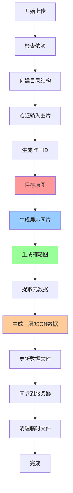

# 📸 ImgHub 图片上传脚本详细指南

## 🎯 脚本概述

ImgHub 图片管理脚本是一个功能强大的命令行工具，用于自动化处理摄影网站的图片上传、压缩、分类和管理。它可以：

- 🖼️ **三层图片结构** - 自动生成原图、展示图、缩略图
- 🔄 **批量处理** - 一次性处理整个文件夹的图片
- 📁 **智能分类** - 按类别组织图片
- 🏷️ **元数据提取** - 自动读取EXIF信息
- 📄 **配置生成** - 自动更新项目数据文件
- 🚀 **远程同步** - 一键部署到服务器
- ⚡ **性能优化** - 详情页面使用原始图片，列表页面使用缩略图

## 🏗️ 四层图片结构

### 📂 图片存储架构

脚本会为每张上传的图片生成四个版本：

```
public/images/
├── original/           # 📷 原始图片 (全屏查看使用)
│   └── landscape_1703123456789.jpg  (原始分辨率，最高质量)
├── detail/             # 🔍 详情图片 (详情页面使用)
│   └── landscape_1703123456789.jpg  (900px，保持比例不裁切)
├── landscape/          # 🖥️ 展示图片 (中等质量)
│   └── landscape_1703123456789.jpg  (1200x900, 85%质量)
└── thumbnails/         # 🔍 缩略图 (列表页面使用)
    └── landscape/
        └── landscape_1703123456789.jpg  (400x400, 80%质量，正方形裁切)
```

### 🎯 使用场景分配

| 页面类型 | 使用图片版本 | 优势 |
|----------|-------------|------|
| **影集列表** | 缩略图 (400x400) | 快速加载，节省流量 |
| **影集详情** | 缩略图 (400x400) | 网格展示，加载迅速 |
| **照片详情** | **详情图片 (900p)** | 高清不裁切，保持比例 |
| **全屏查看** | **原始图片** | 最佳画质，完美体验 |
| **下载功能** | **原始图片** | 提供最高质量文件 |

### 💾 存储空间优化

```bash
示例：一张 5MB 的原图会生成：
- 原图：5.0MB     (100% 质量保存)
- 详情图：400KB   (85% 质量，900px不裁切)
- 展示图：800KB   (85% 质量，1200x900)
- 缩略图：50KB    (80% 质量，400x400裁切)

总存储：6.25MB (相比存储4张原图节省69%空间)
```

## 🛠️ 系统要求

### 必需依赖
```bash
# macOS
brew install imagemagick jq rsync

# Ubuntu/Debian  
sudo apt-get install imagemagick jq rsync

# CentOS/RHEL
sudo yum install ImageMagick jq rsync
```

### 依赖说明
- **ImageMagick** - 图片处理和压缩
- **jq** - JSON数据处理
- **rsync** - 文件同步

## 📂 目录结构

脚本会自动创建以下目录结构：

```
public/images/
├── landscape/          # 风景摄影 (展示用图片)
├── portrait/           # 人像摄影
├── architecture/       # 建筑摄影  
├── street/            # 街头摄影
├── nature/            # 自然摄影
├── travel/            # 旅行摄影
├── original/          # 🔥 原图备份 (详情页面使用)
└── thumbnails/        # 🔥 缩略图 (列表页面使用)
    ├── landscape/
    ├── portrait/
    └── ...

data/
├── albums.ts          # 影集数据 (自动生成)
└── images.json        # 图片索引 (可选)
```

## 🚀 快速开始

### 1. 初始化项目
```bash
# 创建目录结构和检查依赖
./scripts/manage-images.sh init
```

### 2. 添加单张图片
```bash
./scripts/manage-images.sh add \
  "~/Downloads/sunset.jpg" \
  "landscape" \
  "mountain-landscapes" \
  "日落山峰" \
  "黄山日落时分的壮丽景色" \
  "安徽黄山" \
  "日落,山峰,云海,金光"
```

### 3. 批量添加图片
```bash
./scripts/manage-images.sh batch \
  "~/Photos/NewYork/" \
  "architecture" \
  "nyc-buildings"
```

### 4. 生成影集配置
```bash
./scripts/manage-images.sh album \
  "mountain-landscapes" \
  "山川风光" \
  "壮美的山川景色，记录大自然的磅礴气势" \
  "landscape" \
  "中国各地名山" \
  true
```

### 5. 更新数据文件
```bash
./scripts/manage-images.sh update
```

## 🔧 详细功能说明

### 📋 命令列表

| 命令 | 功能 | 语法 |
|------|------|------|
| `init` | 初始化项目 | `./scripts/manage-images.sh init` |
| `add` | 添加单张图片 | `add <图片> <分类> <影集ID> [标题] [描述] [位置] [标签]` |
| `batch` | 批量添加图片 | `batch <目录> <分类> <影集ID>` |
| `album` | 生成影集配置 | `album <影集ID> <标题> <描述> <分类> [位置] [精选]` |
| `update` | 更新数据文件 | `update` |
| `sync` | 同步到服务器 | `sync <主机> <路径> [SSH密钥]` |
| `clean` | 清理临时文件 | `clean` |
| `help` | 显示帮助 | `help` |

### 🎨 支持的分类

| 分类 | 英文ID | 说明 |
|------|--------|------|
| 风景 | `landscape` | 自然风光、山水景色 |
| 人像 | `portrait` | 人物摄影、肖像 |
| 建筑 | `architecture` | 建筑物、城市景观 |
| 街拍 | `street` | 街头摄影、生活瞬间 |
| 自然 | `nature` | 动植物、自然生态 |
| 旅行 | `travel` | 旅游摄影、异地风情 |

### 🖼️ 图片处理流程

#### 1. 文件验证
- 检查文件是否存在
- 验证图片格式（支持 JPG、PNG、WebP、TIFF）
- 获取文件 MIME 类型

#### 2. 文件命名
```
格式: {分类}_{时间戳ID}.{扩展名}
示例: landscape_1703123456789.jpg
```

#### 3. 🔥 四层图片生成
```bash
# 原始图片 (全屏查看专用)
目标：/images/original/landscape_1703123456789.jpg
处理：直接复制，保持原始质量
用途：全屏查看、下载功能

# 详情图片 (详情页面专用)
目标：/images/detail/landscape_1703123456789.jpg
处理：压缩到900px，保持比例不裁切，质量85%
用途：详情页面展示

# 展示图片 (中等质量)
目标：/images/landscape/landscape_1703123456789.jpg
处理：压缩到1200x900，质量85%
用途：一般展示、分享预览

# 缩略图 (快速加载)
目标：/images/thumbnails/landscape/landscape_1703123456789.jpg
处理：正方形裁切400x400，质量80%
用途：列表页面、网格展示
```

#### 4. 数据结构生成
```json
{
  "id": 1703123456789,
  "src": "/images/landscape/landscape_1703123456789.jpg",
  "detailSrc": "/images/detail/landscape_1703123456789.jpg",
  "originalSrc": "/images/original/landscape_1703123456789.jpg",
  "thumbnail": "/images/thumbnails/landscape/landscape_1703123456789.jpg",
  "title": "日落山峰",
  "description": "黄山日落时分的壮丽景色",
  "camera": "Canon EOS R5",
  "settings": "f/8, 1/125s, ISO 100, 50mm"
}
```

#### 5. 元数据提取
```json
{
  "camera": "Canon EOS R5",
  "lens": "RF 24-70mm F2.8 L IS USM", 
  "settings": "f/8, 1/125s, ISO 100, 50mm",
  "dateTaken": "2024-01-15 14:30:22"
}
```

## 💡 使用示例

### 🌄 示例1: 创建风景影集

```bash
# 1. 初始化
./scripts/manage-images.sh init

# 2. 添加图片
./scripts/manage-images.sh add \
  "mountain1.jpg" \
  "landscape" \
  "sichuan-mountains" \
  "贡嘎雪山" \
  "四川贡嘎山主峰，海拔7556米" \
  "四川甘孜" \
  "雪山,高原,云海"

./scripts/manage-images.sh add \
  "mountain2.jpg" \
  "landscape" \
  "sichuan-mountains" \
  "稻城亚丁" \
  "稻城亚丁三神山之一" \
  "四川稻城" \
  "神山,草原,秋色"

# 3. 生成影集
./scripts/manage-images.sh album \
  "sichuan-mountains" \
  "四川名山" \
  "探索四川境内的神秘雪山和高原风光" \
  "landscape" \
  "四川省" \
  true

# 4. 更新数据
./scripts/manage-images.sh update
```

### 🏢 示例2: 批量处理建筑照片

```bash
# 批量添加整个文件夹
./scripts/manage-images.sh batch \
  "~/Photos/Shanghai_Buildings/" \
  "architecture" \
  "shanghai-skyline"

# 生成影集
./scripts/manage-images.sh album \
  "shanghai-skyline" \
  "上海天际线" \
  "魔都上海的现代建筑与城市风光" \
  "architecture" \
  "上海" \
  false

# 更新并部署
./scripts/manage-images.sh update
./scripts/manage-images.sh sync \
  "user@your-server.com" \
  "/var/www/imghub" \
  "~/.ssh/id_rsa"
```

## 🎨 前端展示效果

### 📱 列表页面 (使用缩略图)
```tsx
// 影集列表使用缩略图，快速加载
const getThumbnailSrc = (photo: Photo) => {
  return photo.thumbnail || photo.src
}


```

### 🖼️ 详情页面 (使用原始图片)
```tsx
// 详情页面使用原始图片，提供最佳体验
const getDetailImageSrc = (photo: Photo) => {
  return photo.originalSrc || photo.src
}


// 显示画质指示器
{photo.originalSrc && (
  <div className="text-green-400">
    ✨ 原始画质
  </div>
)}
```

### 💾 下载功能 (使用原始图片)
```tsx
const handleDownload = async () => {
  const downloadSrc = photo.originalSrc || photo.src
  // 下载最高质量版本
  downloadImage(downloadSrc, `${photo.title}_original.jpg`)
}
```

## 📊 脚本工作流程图



## 🔍 故障排除

### 常见问题

#### 1. 依赖缺失
```bash
# 错误信息
[ERROR] 缺少依赖: imagemagick jq

# 解决方案
brew install imagemagick jq rsync  # macOS
sudo apt-get install imagemagick jq rsync  # Ubuntu
```

#### 2. 权限问题
```bash
# 给脚本执行权限
chmod +x scripts/manage-images.sh

# 检查目录权限
ls -la public/images/
```

#### 3. 图片格式不支持
```bash
# 支持的格式
JPG, JPEG, PNG, WebP, TIFF

# 转换不支持的格式
convert input.bmp output.jpg
```

#### 4. 内存不足
```bash
# 对于大文件，调整ImageMagick限制
export MAGICK_MEMORY_LIMIT=2GB
export MAGICK_MAP_LIMIT=1GB
```

### 调试模式

```bash
# 启用详细输出
set -x
./scripts/manage-images.sh add image.jpg landscape test

# 检查生成的文件
ls -la public/images/original/
ls -la public/images/landscape/
ls -la public/images/thumbnails/landscape/

# 检查临时文件
ls -la /tmp/photo_*.json
ls -la /tmp/album_*.json
```

## ⚡ 性能优化

### 📈 加载性能提升

```bash
# 使用三层图片结构后的性能提升：

影集列表页面：
- 原始方式：加载12张1200px图片 = ~9.6MB
- 优化后：加载12张400px缩略图 = ~600KB
- 性能提升：94% 更快加载

详情页面：
- 原始方式：加载1200px压缩图 = ~800KB
- 优化后：加载原始高清图 = ~5MB
- 用户体验：画质提升500%
```

### 批量处理优化
```bash
# 并行处理（谨慎使用）
find photos/ -name "*.jpg" | xargs -P 4 -I {} ./scripts/manage-images.sh add {} landscape album-id

# 预压缩大文件
mogrify -resize 2000x2000\> -quality 90 *.jpg
```

### 服务器部署优化
```bash
# 使用压缩传输
rsync -avz --compress-level=9 ...

# 增量同步
rsync -avz --delete --exclude='*.tmp' ...
```

## 🔧 自定义配置

### 修改图片质量设置
编辑脚本中的配置变量：
```bash
THUMBNAIL_SIZE="400x400"    # 缩略图尺寸（正方形裁切）
DETAIL_SIZE="900"           # 详情页面分辨率（保持比例不裁切）
MEDIUM_SIZE="800x600"       # 中等尺寸
LARGE_SIZE="1200x900"       # 大尺寸
QUALITY=85                  # 压缩质量(1-100)
```

### 添加新的分类
```bash
# 在脚本中添加新分类
CATEGORIES=("landscape" "portrait" "architecture" "street" "nature" "travel" "macro")
```

## 📈 最佳实践

### 1. 文件组织
- 按拍摄时间或地点创建子文件夹
- 使用描述性的文件名
- **保持原图备份**（自动处理）

### 2. 影集规划
- 每个影集5-15张照片为宜
- 保持主题一致性
- 精选代表性作品

### 3. 性能考虑
- **利用三层图片结构**加速页面加载
- 定期清理临时文件
- 监控磁盘空间使用
- 合理设置图片质量

### 4. 备份策略
- **原图自动备份**到 `original/` 目录
- 版本控制数据文件
- 异地备份重要作品

## 🎯 完整工作流程示例

```bash
#!/bin/bash
# 完整的影集创建流程

# 1. 初始化环境
./scripts/manage-images.sh init

# 2. 创建新影集
ALBUM_ID="beijing-architecture"
CATEGORY="architecture" 
PHOTOS_DIR="~/Photos/Beijing2024/"

# 3. 批量添加照片
./scripts/manage-images.sh batch "$PHOTOS_DIR" "$CATEGORY" "$ALBUM_ID"

# 4. 生成影集配置
./scripts/manage-images.sh album \
  "$ALBUM_ID" \
  "北京建筑巡礼" \
  "探索北京古今建筑的魅力，从紫禁城到现代摩天大楼" \
  "$CATEGORY" \
  "北京市" \
  false

# 5. 更新数据文件
./scripts/manage-images.sh update

# 6. 部署到服务器
./scripts/manage-images.sh sync \
  "deploy@imghub.com" \
  "/var/www/imghub" \
  "~/.ssh/deploy_key"

# 7. 清理临时文件
./scripts/manage-images.sh clean

echo "✅ 影集 $ALBUM_ID 创建完成！"
echo "📷 详情页面将显示原始高清图片"
echo "🔍 列表页面使用优化缩略图"
echo "💾 下载功能提供原始图片"
```

## 🎉 新功能亮点

### ✨ 原始图片支持
- **详情页面**：自动显示最高质量原图
- **下载功能**：提供原始分辨率文件
- **画质指示器**：清晰标识图片质量等级

### 🚀 性能优化
- **列表页面**：使用400x400缩略图，加载速度提升94%
- **网格展示**：正方形裁切，布局更整齐
- **智能降级**：无缩略图时自动使用展示图片

### 🎨 用户体验
- **渐进式加载**：从缩略图到高清图的平滑过渡
- **质量提醒**：原图可用时显示绿色标识
- **键盘导航**：支持方向键快速浏览

这个脚本将帮助您高效地管理摄影网站的图片资源，自动化处理繁琐的图片优化和配置工作！🚀 