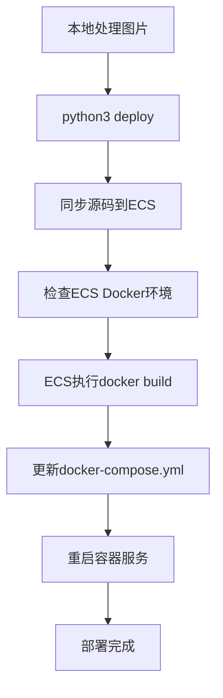
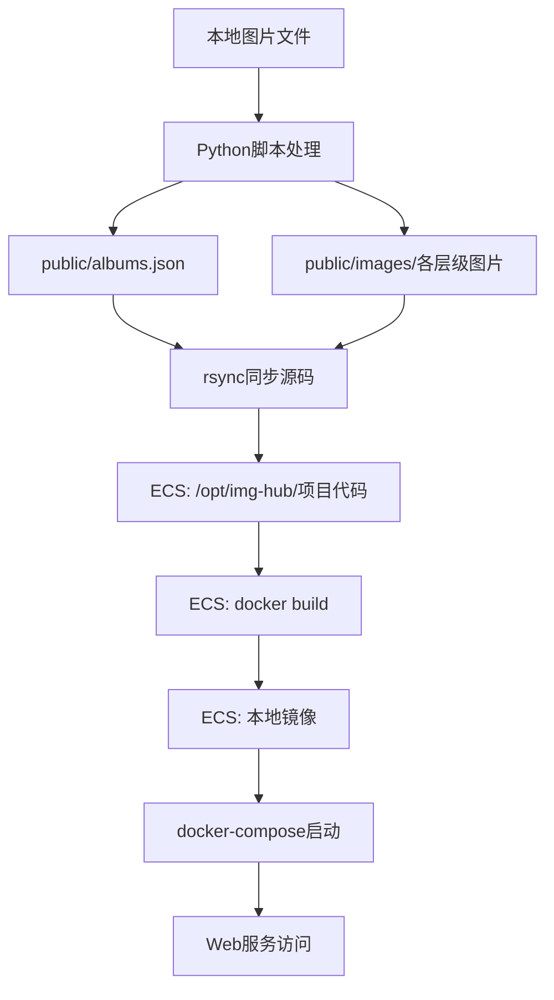

# ImgHub 脚本工具说明

## 📋 当前架构 (v3.1.0+)

| 工具 | 状态 | 用途 | 推荐度 |
|------|------|------|--------|
| **`img-manager.py`** | ✅ **活跃** | 本地图片处理和测试 | ⭐⭐⭐⭐⭐ |
| **`../deploy.sh`** | ✅ **活跃** | ECS部署和运维 | ⭐⭐⭐⭐⭐ |
| ~~`img-manager.sh`~~ | ❌ **已废弃** | ~~一体化脚本~~ | ❌ |

## 🔄 新的工作流程

### 1. 本地图片处理
```bash
# 使用Python脚本处理图片
python3 scripts/img-manager.py local-test
```

### 2. 部署到ECS
```bash
# 使用独立部署脚本
./deploy.sh transfer    # 或 ./deploy.sh build
```

--- 

## 🐍 Python 图片管理工具 (活跃)

**文件：** `img-manager.py`

### 核心功能
- ✅ **四层图片处理**：缩略图(400px) → 展示图(800px) → 详情图(900px) → 原图(无损)
- ✅ **EXIF数据提取**：自动提取相机信息、拍摄参数等
- ✅ **JSON数据管理**：自动更新 `public/albums.json`
- ✅ **交互式界面**：友好的用户操作体验
- ✅ **ECS远程构建**：同步源码到ECS，远程Docker构建部署
- ⭐ **原图无损保存**：100%保持原始质量，不进行任何压缩

### 使用方法
```bash
# 查看帮助
python3 scripts/img-manager.py help

# 本地测试模式（主要功能）
python3 scripts/img-manager.py local-test

# ECS远程构建部署
python3 scripts/img-manager.py deploy

# 配置ECS连接信息
python3 scripts/img-manager.py ecs-config

# 查看数据状态
python3 scripts/img-manager.py status

# 启动本地预览
python3 scripts/img-manager.py local-preview
```

### 典型工作流程
```bash
# 1. 本地处理图片（会询问是否上传到ECS）
python3 scripts/img-manager.py local-test

# 2. 或者分步操作
python3 scripts/img-manager.py local-test  # 仅本地处理
python3 scripts/img-manager.py deploy      # ECS远程构建
```

### ECS远程构建方案
**新特性**：无需本地Docker环境，所有构建在ECS完成

**工作流程**：
1. **源码同步**：rsync同步整个项目到ECS
2. **远程构建**：ECS上执行 `docker build`
3. **自动部署**：更新docker-compose并重启服务

**优势**：
- ✅ **无需本地Docker**：本地只需要Python和基础工具
- ✅ **构建速度快**：ECS网络环境通常更好
- ✅ **部署一致性**：构建和运行在同一环境
- ✅ **节省带宽**：不需要传输大型镜像文件

### 依赖要求
- **本地环境**: Python 3.6+, ImageMagick, ExifTool, rsync, ssh
- **ECS环境**: Docker, Docker Compose

```bash
# 本地 macOS 安装依赖
brew install imagemagick exiftool rsync openssh

# 本地 Ubuntu 安装依赖
sudo apt install imagemagick libimage-exiftool-perl rsync openssh-client

# ECS Docker 安装（Ubuntu示例）
curl -fsSL https://get.docker.com -o get-docker.sh
sudo sh get-docker.sh
sudo curl -L "https://github.com/docker/compose/releases/download/v2.20.0/docker-compose-$(uname -s)-$(uname -m)" -o /usr/local/bin/docker-compose
sudo chmod +x /usr/local/bin/docker-compose
```

### ECS配置说明
- **配置文件**: `.env.deploy` (自动生成)
- **支持方式**: SSH密钥 / 密码登录
- **同步方式**: rsync同步源码，排除不必要文件
- **构建方式**: ECS上Docker远程构建

**配置示例**:
```bash
# .env.deploy 文件内容
ECS_HOST="123.456.789.10"
ECS_USER="root"
SSH_KEY="/path/to/your/private/key"  # 可选
DEPLOY_PATH="/opt/img-hub"
```

### 部署流程详解


## 🚀 ECS 部署工具 (活跃)

**文件：** `../deploy.sh`

### 核心功能
- ✅ **多种部署方案**：本地构建传输 / 远程构建 / 镜像仓库
- ✅ **自动化部署**：一键部署到ECS
- ✅ **数据同步**：自动同步 `public` 目录到ECS
- ✅ **服务管理**：启动、重启、状态检查、日志查看

### 使用方法
```bash
# 方案1: 本地构建+传输（推荐）
./deploy.sh transfer

# 方案2: ECS远程构建
./deploy.sh build

# 仅同步数据
./deploy.sh data

# 运维操作
./deploy.sh restart    # 重启服务
./deploy.sh status     # 查看状态
./deploy.sh logs       # 查看日志
```

## ⚠️ 已废弃工具

### ~~img-manager.sh~~ (已废弃)

**状态**: ❌ 不再维护，建议迁移

**废弃原因**:
- 功能重复：Python脚本提供了更好的图片处理
- 架构冲突：一体化设计与新的分离架构不符
- 维护负担：两套脚本增加维护复杂度
- 用户困惑：多个入口点造成使用困惑

**迁移指南**:
```bash
# 旧方式 (废弃)
./scripts/img-manager.sh local-test
./scripts/img-manager.sh deploy

# 新方式 (推荐)
python3 scripts/img-manager.py local-test    # 图片处理
./deploy.sh transfer                          # ECS部署
```

## 🎯 最佳实践

### 典型工作流程

1. **本地开发和测试**:
   ```bash
   # 处理图片并更新数据
   python3 scripts/img-manager.py local-test
   
   # 本地预览效果
   python3 scripts/img-manager.py local-preview
   ```

2. **部署到ECS**:
   ```bash
   # 首次部署
   ./deploy.sh transfer
   
   # 后续仅更新数据
   ./deploy.sh data
   ```

3. **运维管理**:
   ```bash
   # 查看服务状态
   ./deploy.sh status
   
   # 查看日志
   ./deploy.sh logs
   ```

### 数据流向

**ECS远程构建架构**：


## 🔄 数据管理流程

### ECS远程构建的数据同步机制

1. **本地处理**: Python脚本生成4层图片并更新JSON
2. **源码同步**: rsync同步整个项目到ECS
3. **远程构建**: ECS上执行docker build生成镜像
4. **服务部署**: 更新docker-compose并启动容器
5. **Web访问**: Nginx提供图片和数据的Web访问

### 存储位置
```
本地:     ./项目根目录          →  ECS: /opt/img-hub/
本地:     ./public/albums.json  →  ECS: /opt/img-hub/public/albums.json
本地:     ./public/images/      →  ECS: /opt/img-hub/public/images/
本地:     ./Dockerfile          →  ECS: /opt/img-hub/Dockerfile
```

### Docker镜像构建
```bash
# ECS上的构建过程
cd /opt/img-hub
docker build -t img-hub:latest .
docker-compose up -d
```

### Docker挂载配置
```yaml
# ECS上的docker-compose.yml
services:
  img-hub:
    image: img-hub:latest  # 使用本地构建的镜像
    volumes:
      - /opt/img-hub/public:/usr/share/nginx/html/public:ro
``` 