# ImgHub 脚本工具说明

## 📋 当前架构 (v3.1.0+)

| 工具 | 状态 | 用途 | 推荐度 |
|------|------|------|--------|
| **`img-manager.py`** | ✅ **活跃** | 本地图片处理和测试 | ⭐⭐⭐⭐⭐ |
| **`../deploy.sh`** | ✅ **活跃** | ECS部署和运维 | ⭐⭐⭐⭐⭐ |
| ~~`img-manager.sh`~~ | ❌ **已废弃** | ~~一体化脚本~~ | ❌ |

## 🔄 新的工作流程

### 1. 本地图片处理
```bash
# 使用Python脚本处理图片
python3 scripts/img-manager.py local-test
```

### 2. 部署到ECS
```bash
# 使用独立部署脚本
./deploy.sh transfer    # 或 ./deploy.sh build
```

--- 

## 🐍 Python 图片管理工具 (活跃)

**文件：** `img-manager.py`

### 核心功能
- ✅ **四层图片处理**：缩略图(400px) → 展示图(800px) → 详情图(900px) → 原图(无损)
- ✅ **EXIF数据提取**：自动提取相机信息、拍摄参数等
- ✅ **JSON数据管理**：自动更新 `public/albums.json`
- ✅ **交互式界面**：友好的用户操作体验
- ✅ **一键ECS部署**：集成rsync+ssh，自动同步到ECS
- ⭐ **原图无损保存**：100%保持原始质量，不进行任何压缩

### 使用方法
```bash
# 查看帮助
python3 scripts/img-manager.py help

# 本地测试模式（主要功能）
python3 scripts/img-manager.py local-test

# 一键部署到ECS
python3 scripts/img-manager.py deploy

# 配置ECS连接信息
python3 scripts/img-manager.py ecs-config

# 查看数据状态
python3 scripts/img-manager.py status

# 启动本地预览
python3 scripts/img-manager.py local-preview
```

### 典型工作流程
```bash
# 1. 本地处理图片（会询问是否上传到ECS）
python3 scripts/img-manager.py local-test

# 2. 或者分步操作
python3 scripts/img-manager.py local-test  # 仅本地处理
python3 scripts/img-manager.py deploy      # 单独部署
```

### 依赖要求
- **基础功能**: Python 3.6+, ImageMagick, ExifTool
- **ECS部署**: rsync, ssh

```bash
# macOS 安装依赖
brew install imagemagick exiftool rsync openssh

# Ubuntu 安装依赖
sudo apt install imagemagick libimage-exiftool-perl rsync openssh-client
```

### ECS配置说明
- **配置文件**: `.env.deploy` (自动生成)
- **支持方式**: SSH密钥 / 密码登录
- **同步方式**: rsync增量同步，速度快
- **自动重启**: 同步后自动重启Docker容器

**配置示例**:
```bash
# .env.deploy 文件内容
ECS_HOST="123.456.789.10"
ECS_USER="root"
SSH_KEY="/path/to/your/private/key"  # 可选
DEPLOY_PATH="/opt/img-hub"
```

## 🚀 ECS 部署工具 (活跃)

**文件：** `../deploy.sh`

### 核心功能
- ✅ **多种部署方案**：本地构建传输 / 远程构建 / 镜像仓库
- ✅ **自动化部署**：一键部署到ECS
- ✅ **数据同步**：自动同步 `public` 目录到ECS
- ✅ **服务管理**：启动、重启、状态检查、日志查看

### 使用方法
```bash
# 方案1: 本地构建+传输（推荐）
./deploy.sh transfer

# 方案2: ECS远程构建
./deploy.sh build

# 仅同步数据
./deploy.sh data

# 运维操作
./deploy.sh restart    # 重启服务
./deploy.sh status     # 查看状态
./deploy.sh logs       # 查看日志
```

## ⚠️ 已废弃工具

### ~~img-manager.sh~~ (已废弃)

**状态**: ❌ 不再维护，建议迁移

**废弃原因**:
- 功能重复：Python脚本提供了更好的图片处理
- 架构冲突：一体化设计与新的分离架构不符
- 维护负担：两套脚本增加维护复杂度
- 用户困惑：多个入口点造成使用困惑

**迁移指南**:
```bash
# 旧方式 (废弃)
./scripts/img-manager.sh local-test
./scripts/img-manager.sh deploy

# 新方式 (推荐)
python3 scripts/img-manager.py local-test    # 图片处理
./deploy.sh transfer                          # ECS部署
```

## 🎯 最佳实践

### 典型工作流程

1. **本地开发和测试**:
   ```bash
   # 处理图片并更新数据
   python3 scripts/img-manager.py local-test
   
   # 本地预览效果
   python3 scripts/img-manager.py local-preview
   ```

2. **部署到ECS**:
   ```bash
   # 首次部署
   ./deploy.sh transfer
   
   # 后续仅更新数据
   ./deploy.sh data
   ```

3. **运维管理**:
   ```bash
   # 查看服务状态
   ./deploy.sh status
   
   # 查看日志
   ./deploy.sh logs
   ```

### 数据流向

```mermaid
graph TD
    A[本地图片文件] --> B[Python脚本处理]
    B --> C[public/albums.json]
    B --> D[public/images/各层级图片]
    C --> E[部署脚本同步]
    D --> E
    E --> F[ECS: /opt/img-hub/public/]
    F --> G[Docker容器挂载]
    G --> H[Web服务访问]
```



## 🔄 数据管理流程

### 完整的数据同步机制

1. **本地处理**: Python脚本生成4层图片并更新JSON
2. **ECS同步**: 部署脚本通过rsync同步到ECS
3. **容器挂载**: Docker自动挂载ECS本地数据
4. **Web访问**: Nginx提供图片和数据的Web访问

### 存储位置
```
本地:     ./public/albums.json  →  ECS: /opt/img-hub/public/albums.json
本地:     ./public/images/      →  ECS: /opt/img-hub/public/images/
```

### Docker挂载配置
```yaml
volumes:
  # 挂载整个public目录，包含images和albums.json
  - /opt/img-hub/public:/usr/share/nginx/html/public:ro
``` 